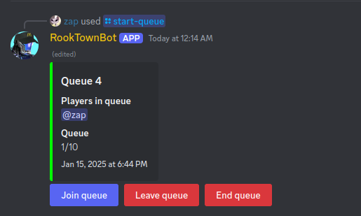
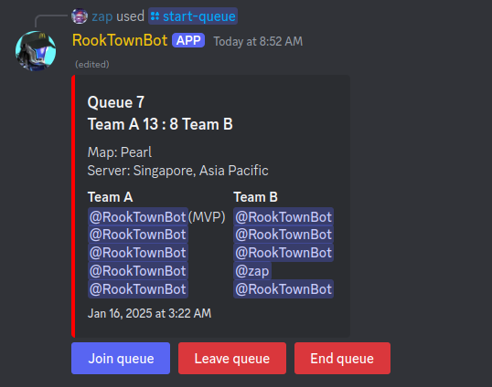
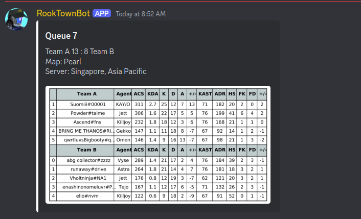
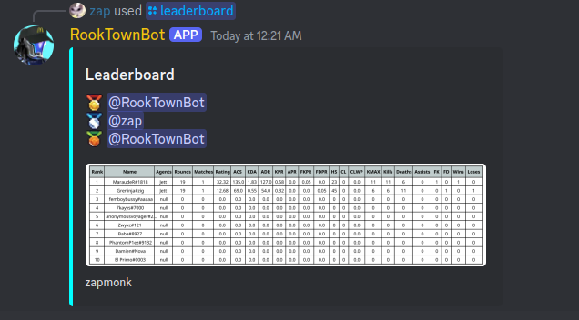
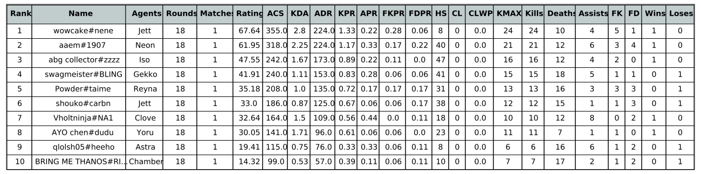

# 👾 ShadowQBot

ShadowQBot is a Java-based Discord bot designed to manage queues for Valorant custom matches. It provides functionalities for players to join, leave, and end queues, as well as to display match results and update leaderboards.

## ✨ Features

- Join and leave queues
- End queues and display match results
- Update leaderboards with match statistics
- Integration with Henrik-Dev Unofficial Valorant API for player data and match details

## ⚙️Commands

- /get-started : Link discord account and valorant account
- /start-queue : Used to start a queue for a custom match
- /leaderboard : Used to display the current leaderboard
- /purge : Delete messages

## 📸 Screenshots







## 🛠️ Technologies Used

- Java
- Gradle
- SQLite 

## 🚀 Getting Started

### 📋 Prerequisites

- Java 11 or higher
- Gradle
- Discord bot token
- Henrik-Dev Valorant API token

### 🛠️ Installation

1. Clone the repository:
    ```sh
    git clone https://github.com/yourusername/RookTownBot.git
    cd RookTownBot
    ```
    
2. Create a .env file and add the following

   ```
   DISCORD_BOT_TOKEN=YOUR_DISCORD_BOT_TOKEN
   HENRIKDEV_API_KEY=YOUR_HENRIK_DEV_API_KEY
   DATABASE_URL=YOUR_DATABASE_URL
   LEADERBOARD_IMAGES_PATH=IMAGE_PATH
   SCOREBOARD_IMAGES_PATH=IMAGE_PATH
   ```


3. Build the project:
    ```sh
    gradle build
    ```

4. Run the bot:
    ```sh
    gradle run
    ```

## 📚 Usage

- Use the provided commands to manage queues in your Discord server.
- Ensure the bot has the necessary permissions to read and send messages in the channels.

## 🤝 Contributing

Contributions are welcome! Please fork the repository and create a pull request with your changes.

## 📜 License

This project is licensed under the MIT License. See the `LICENSE` file for details.

## 🙏 Acknowledgements
- [Discord API](https://discord.com/developers/docs/intro)
- [Valorant API](https://github.com/Henrik-3/unofficial-valorant-api)

